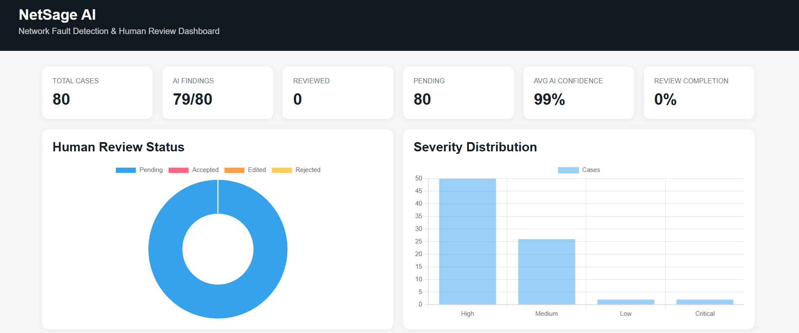

# NetSage AI
### AI-assisted Network Fault Detection & Human Review Platform

NetSage AI is a network troubleshooting platform that combines a **deterministic Cisco/network rule engine**, **Gemini-powered diagnosis**, and a **human-in-the-loop review workflow** — all summarized visually in a static HTML dashboard.

The system is designed around a simple principle:

> **deterministic evidence first → AI explanation second → human validation before acceptance**

It currently evaluates a dataset of **80 network troubleshooting cases (C001–C080)** covering VLANs, trunking, DHCP, DNS, routing, OSPF, ACLs, NAT/PAT, IP configuration, and related network faults.

---
## 🚀 Live Demo

**[Open NetSage AI →](https://akshat-yash-107-netsage-ai-app-6k2kq9.streamlit.app/)**

Try the deployed application to:
- Analyze network troubleshooting cases
- View deterministic rule findings
- Generate Gemini-powered diagnoses
- Submit human review decisions

## 📊 

The dashboard is the **visual reporting layer** of NetSage AI. It's a self-contained, static HTML file generated by `build_dashboard.py`, so it can be opened directly in any browser — no server required.

**What it shows:**
- Overall deterministic rule engine accuracy across all 80 cases
- Breakdown of correct / wrong / missed / unmapped fault detections
- Per-case summary (case ID, fault family, severity, AI confidence)
- Human review status per case (Accepted / Edited / Rejected / Pending)
- Agreement rate between AI diagnosis and human reviewer decisions

**How to generate it:**

```bash
python build_dashboard.py
```

This reads from `data/cases.csv` and `reviews/review_log.csv`, then writes the compiled report to:

```
dashboard/dashboard.html
```

**How to view it:**

Simply open the file in a browser:

```bash
# Windows
start dashboard/dashboard.html

# macOS
open dashboard/dashboard.html

# Linux
xdg-open dashboard/dashboard.html
```

> 💡 Re-run `build_dashboard.py` any time after updating `reviews/review_log.csv` (e.g. after reviewing more cases in the Streamlit app) to refresh the dashboard with the latest numbers.

---

## What NetSage AI Does

For each troubleshooting case, NetSage AI:

1. Loads the network symptom, topology information, and command output.
2. Runs **deterministic rules** against the evidence.
3. Identifies the relevant network fault family.
4. Sends the case to **Gemini** for an explainable diagnosis, producing:
   - Root cause
   - Supporting evidence
   - OSI layer
   - Confidence
   - Next diagnostic command
   - Recommended fix steps
   - Alternative causes
5. Presents the diagnosis in a **Streamlit** interface.
6. Lets a human reviewer **Accept / Edit / Reject** the diagnosis.
7. Stores the review decision in `reviews/review_log.csv`.
8. Rolls all of the above up into the **dashboard** for at-a-glance reporting.

---

## Architecture

```
┌──────────────────────┐
│      cases.csv        │
│     C001 - C080        │
└──────────┬─────────────┘
           │
           ▼
┌──────────────────────┐
│  Deterministic Rule   │
│       Checker         │
└──────────┬─────────────┘
           │
  verified fault evidence
           │
           ▼
┌──────────────────────┐
│    Gemini Diagnosis   │
│   explanation layer   │
└──────────┬─────────────┘
           │
           ▼
┌──────────────────────┐
│    Streamlit App      │
│  Diagnosis + Review   │
└──────────┬─────────────┘
           │
     human decision
           │
           ▼
┌──────────────────────┐
│    review_log.csv     │
│  Accept/Edit/Reject   │
└──────────┬─────────────┘
           │
           ▼
┌──────────────────────┐
│  dashboard/           │
│  dashboard.html        │
│  (visual report)       │
└──────────────────────┘
```

---

## Key Design Decision

NetSage AI does **not** rely on an LLM alone to decide whether a network fault exists.

The deterministic rule engine provides the verified fault-detection layer. Gemini is used to turn the available evidence into a structured, human-readable diagnosis. This reduces the risk of an LLM inventing a network condition that isn't supported by the supplied command output.

---

## Project Structure

```
NETSAGE_AI/
│
├── ai/
│   ├── diagnose.py
│   └── diagnose_prompt.md
│
├── checker/
│   └── rule_checker.py
│
├── dashboard/
│   └── dashboard.html          ← generated visual report
│
├── data/
│   └── cases.csv
│
├── reviews/
│   └── review_log.csv
│
├── app.py                      ← Streamlit review app
├── build_dashboard.py          ← generates dashboard/dashboard.html
├── build_review_log.py         ← builds/aligns the review log
├── evaluate_rules.py           ← runs deterministic rule audit
├── main.py
├── requirements.txt
└── README.md
```

---

## Rule Coverage

The deterministic checker currently covers fault families including:

| Fault family | Example |
|---|---|
| `wrong_vlan_assignment` | Access port assigned to the wrong VLAN |
| `trunk_vlan_not_allowed` | Required VLAN missing from trunk allowed list |
| `missing_vlan` | Required VLAN is absent |
| `vtp_revision_problem` | Incorrect VTP database revision |
| `gateway_mismatch` | Incorrect default gateway |
| `interface_down` | Relevant interface/link is down |
| `duplicate_ip` | Duplicate host IP configuration |
| `wrong_mask` | Incorrect subnet mask |
| `missing_dhcp_relay` | Missing DHCP helper/relay |
| `dhcp_pool_exhaustion` | DHCP pool exhausted |
| `dhcp_pool_overlap` | Overlapping DHCP networks |
| `missing_dhcp_dns_option` | Missing DNS option in DHCP pool |
| `wrong_dhcp_network` | DHCP pool serves the wrong network |
| `dhcp_service_disabled` | DHCP service disabled |
| `missing_dns_record` | Required DNS record missing |
| `missing_dns_forwarder` | DNS forwarder missing |
| `stale_dns_record` | Stale DNS record |
| `dns_unreachable` | DNS service unreachable |
| `wrong_dns_server` | Incorrect DNS server configured |
| `dns_zone_problem` | DNS zone problem |
| `missing_route` | Required route missing |
| `routing_loop` | Routing loop |
| `ospf_area_mismatch` | OSPF area mismatch |
| `ospf_timer_mismatch` | OSPF timer mismatch |
| `ospf_network_statement` | Incorrect OSPF network statement |
| `acl_block` | ACL blocks required traffic |
| `acl_shadowing` | ACL rule shadowing |
| `acl_ordering` | Incorrect ACL rule ordering |
| `acl_vty_mismatch` | Wrong ACL applied to VTY |
| `nat_inside_missing` | Missing NAT inside designation |
| `nat_outside_missing` | Missing NAT outside designation |
| `pat_missing` | PAT/overload configuration missing |
| `static_nat_problem` | Static NAT problem |
| `nat_acl_problem` | NAT source ACL problem |
| `nat_pool_exhaustion` | NAT pool exhausted |
| `stale_ip_configuration` | Host retains stale IP configuration |
| `trunk_mode_mismatch` | Trunk/access mode mismatch |
| `native_vlan_mismatch` | Native VLAN mismatch |

---

## Validation

The current deterministic audit covers all 80 cases.

**Latest validation result:**

```
Total cases        : 80
Correct            : 77
Wrong rule         : 0
Missed             : 0
Unmapped expected  : 3
Accuracy           : 100.0%
```

**What the 100% means:**

The reported 100% is the accuracy of the *mapped* deterministic rule evaluation. There are 3 cases whose expected fault is intentionally **unmapped**. They are not counted as successful fault mappings:

```
Correct mapped cases  : 77
Wrong mapped cases    : 0
Missed mapped cases   : 0
Unmapped expected     : 3
```

This distinction is kept explicit instead of treating unmapped cases as correct predictions. These same numbers are what populate the summary tiles at the top of `dashboard/dashboard.html`.

---

## Human Review

NetSage AI includes a human review layer because an AI-generated explanation should not automatically become the final operational decision.

Each case can be marked:

- **Accepted** — reviewer agrees with the diagnosis.
- **Edited** — reviewer changes/corrects the diagnosis.
- **Rejected** — reviewer does not accept the diagnosis.

The review log preserves:

```
case_id
category
severity
ai_root_cause
ai_confidence
human_status
agreement
reviewer_note
```

Cases that have not been reviewed remain **Pending**, and the dashboard reflects this pending count. The system does not fabricate human decisions.

---

## Gemini Integration

The AI diagnosis layer uses Google's Gemini API through the `google-genai` Python SDK.

The API key is read from an environment variable:

```
GEMINI_API_KEY
```

The key is intentionally **not** stored in source code or the repository.

**Set the key (Windows PowerShell):**

```powershell
$env:GEMINI_API_KEY="YOUR_GEMINI_API_KEY"
```

**Verify:**

```powershell
C:\Python313\python.exe -c "import os; print('KEY OK' if os.getenv('GEMINI_API_KEY') else 'KEY MISSING')"
```

Expected: `KEY OK`

**Optionally choose the model:**

```powershell
$env:GEMINI_MODEL="gemini-3.6-flash"
```

---

## Installation

Python 3.13 is used for the current development environment.

**Install dependencies:**

```bash
C:\Python313\python.exe -m pip install -r requirements.txt
```

**If `google-genai` is not already present:**

```bash
C:\Python313\python.exe -m pip install -U google-genai
```

---

## Usage

### 1. Run the Deterministic Audit

```bash
C:\Python313\python.exe evaluate_rules.py
```

Evaluates the complete C001–C080 dataset and reports correct detections, wrong rules, missed cases, unmapped expected faults, per-rule results, and overall accuracy.

### 2. Build the Review Log

```bash
C:\Python313\python.exe build_review_log.py
```

Validates that all 80 cases (C001–C080) are represented and preserves existing human decisions rather than fabricating them.

### 3. Build the Dashboard

```bash
C:\Python313\python.exe build_dashboard.py
```

Generates `dashboard/dashboard.html` from the current cases and review log. Open it directly in a browser to view the report.

### 4. Run the Streamlit Application

```bash
C:\Python313\python.exe -m streamlit run app.py
```

Then open the local URL shown by Streamlit, normally `http://localhost:8501`.

---

## Typical Workflow

1. **Select a case** — e.g. `C001`
2. **Run the deterministic checker** — displays the verified rule finding, e.g. `[HIGH] wrong_vlan_assignment`
3. **Run Gemini diagnosis** — Gemini receives the case evidence and returns a structured diagnosis:
   ```
   OSI Layer   : Layer 2
   Confidence  : high
   Severity    : Medium

   Root Cause:
   Interface FastEthernet0/2 is incorrectly configured in VLAN 20
   instead of VLAN 10.

   Next Command:
   show running-config interface Fa0/2
   ```
4. **Human review** — reviewer chooses `Accepted`, `Edited`, or `Rejected`, and can add a reviewer note.
5. **Persist the decision** — stored in `reviews/review_log.csv`.
6. **Refresh the dashboard** — re-run `build_dashboard.py` to see the updated stats in `dashboard/dashboard.html`.

---

## Example Case: C001

**Problem:** A host is experiencing connectivity problems because its access switchport is assigned to the wrong VLAN.

**Deterministic finding:** `wrong_vlan_assignment`

**AI explanation:** The AI explains why the command output supports the finding and recommends the next Cisco command to inspect the interface.

**Human reviewer:** Confirms, edits, or rejects the diagnosis.

This demonstrates the complete pipeline:

```
Evidence → Rule → AI Explanation → Human Validation → Audit Log → Dashboard
```

---

## Safety and Reliability

NetSage AI is designed as a **troubleshooting assistant**, not an autonomous network-change system. The application:

- Does **not** automatically change Cisco configurations
- Does **not** fabricate human approvals
- Keeps deterministic detection separate from AI explanation
- Exposes the evidence used for the diagnosis
- Provides a next diagnostic command before recommending a fix
- Records human review decisions

Any configuration change should still be validated by an authorized network administrator.

---

## Technologies

- Python
- Pandas
- Streamlit
- Google Gemini API (`google-genai`)
- CSV
- HTML / CSS / JavaScript (dashboard)
- Cisco networking concepts
- Deterministic rule-based fault detection
- Human-in-the-loop review

---

## Project Goal

NetSage AI demonstrates how traditional deterministic network troubleshooting can be combined with modern AI **without giving the AI complete control over the decision process**.

> Use rules for what can be verified, AI for explanation and reasoning, and humans for final judgment.

---

## Current Status

```
Dataset                    : 80 cases
Deterministic validation   : 77 mapped correct
Wrong deterministic rules  : 0
Missed mapped cases        : 0
Unmapped expected cases    : 3
Streamlit application      : Working
Gemini diagnosis           : Working
Human review workflow      : Working
Review log                 : 80-case aligned
Dashboard (dashboard.html) : Working
```

---

## Future Improvements

- Expand the deterministic rule library
- Map the remaining intentionally unmapped fault families
- Add richer Cisco command parsing
- Add reviewer authentication and timestamps
- Add case-level audit history
- Add automated regression tests for every rule
- Add confidence calibration against reviewer outcomes
- Add retrieval of Cisco documentation for evidence-backed recommendations
- Add deployment with secure secret management
- Add monitoring of AI-vs-human disagreement patterns
- Add live/interactive charts to `dashboard.html` (currently static summary)

---

## Author

**Akshat Shrivastava**

*NetSage AI — Network Fault Detection & Human Review Platform*
